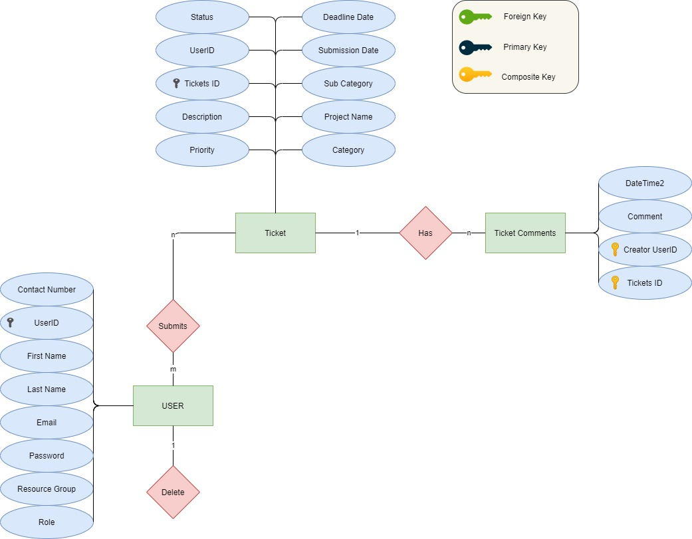
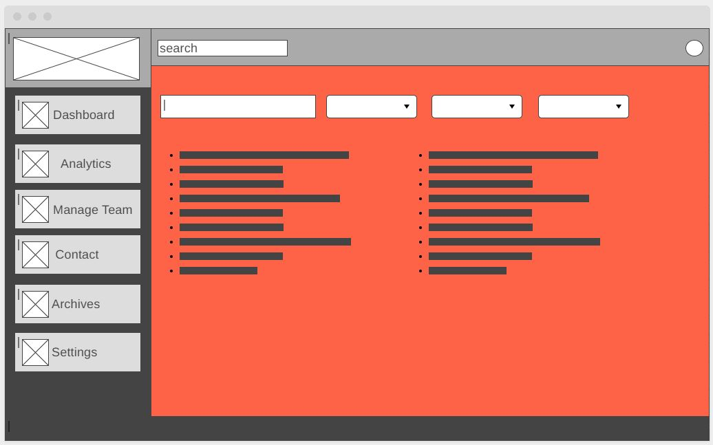
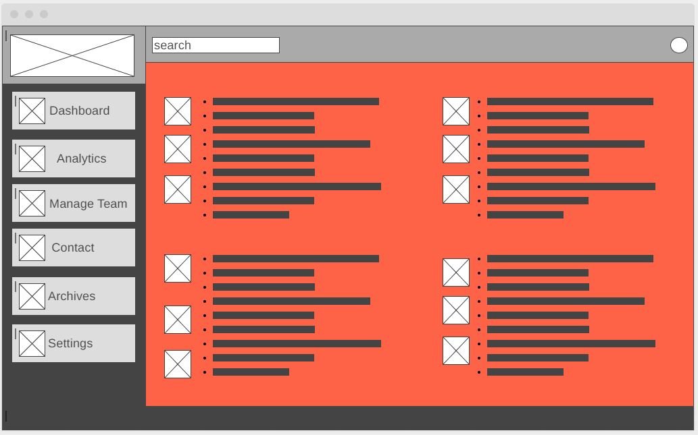

 ## Table of Contents
 1. [Why Insectic?](#head)
 2. [What is Insectic](#head2)
 3. [Case Use Diagram](#head3)
 4. [ERD](#erd)
 5. [Draft WireFrames](#head4)
    1. [Dashboard page](#head41)
    2. [Analytics page](#head42)
    3. [Archive page](#head43)
    4. [Ticket Submission page](#head44)
    5. [Contact page](#head45)
 6. [User Stories](#head5)
 7. [Use Cases](#head6)
 8. [Requirements](#head7)

***

 # 
 :beetle: Why Insectic? :beetle: [:arrow_up_small:](#table-of-contents) 
 

Insectic is a side project I am working on to help viuslize one of the 4 pillars of work; Unplanned work. This idea came to me after reading <i>The Phoenix Project</i> I wanted to follow along with Bill and Patty and see if I could create an application that would of helped visualize, track, and streamline the complition of unplanned tasks and work. 

## 
 :beetle: What Is Insectic? :beetle: [:arrow_up_small:](#table-of-contents) 

Insectic will be an interactive bug/patches tracking web application that will forcus on the unplanned work aspect of DevOPs. This Web application will allow Managers to track current items being worked on with detailed statistics to help locate bottle necks. Team leaders will be able to utilize this tool to task out team members, track team progress and will be able to see team analytics to better articulate the needs of the team to the department manager. 
***

### 
 :page_facing_up: [Case Use Diagram](https://github.com/Darius-D/Insectic/blob/main/CaseUseDiagram.jpg) :page_facing_up: 

***
### 
 ERD [:arrow_up_small:](#table-of-contents) 

***

***

###     
 DRAFT WIREFRAMES [:arrow_up_small:](#table-of-contents) 

***

###   
 Dashboard/Home [:arrow_up_small:](#table-of-contents) 

###  
 Analytics Page [:arrow_up_small:](#table-of-contents) 

***

###   
 Archives Page [:arrow_up_small:](#table-of-contents) 

***

###   
 Ticket Submission [:arrow_up_small:](#table-of-contents) 

  
  
  

  
  

***

###   
  Contact Page [:arrow_up_small:](#table-of-contents) 

***

### 
 User Stories [:arrow_up_small:](#table-of-contents) 

1. As a Department Manager, I need to create “tickets” when ever a problem is detected in our process, so that we can visualize the bottleneck and common trends. 
2. As a Department Manager, I need to see the analytics of all the tickets in our system so that I can provide detailed reports to the CEO. 
3. As a Team lead, I need to be able manage my team assign them to tasks so that I can provide the Department Manager with daily status updates. 
4. As a Team Members, I need to be able to submit tickets for issues encountered with a detailed description and categories so that my team lead can articulate our current issues and progress with the Department Manager

***
### 
 Use Cases [:arrow_up_small:](#table-of-contents) 

* Given a new user
When user fills out application
Then assign values to new user object

* Given a user discovers a reportable issue
When all required forms are filled properly, 
Then create a ticket object and store the data.

* Given a ticket number 
when a user desires to update a ticket
Then pull ticket data and allow comments to be added and update database. 

* Given a ticket number, 
When a team member desires to close a ticket, 
Then query ticket and change status to pending closure and alert Department Manager.

* Given a ticket number, 
When a Department manager desires to close a ticket, 
Then query ticket and change status to close to add to archives.

* Given a Ticket ID
When user wants to view the ticket
Then populate the ticket into a table.

* Given a filtering condition, 
When user wants to pull analytics, 
Then generate a query that outputs values to display the count of all tickets by category, subcategory.

* Given a user ID
When a user needs to be assigned to a group
Then populate drop by selection to select groups available and update user’s group in DB.

*** 
### 
 Requirements [:arrow_up_small:](#table-of-contents) 

1. The system shall create a user account with all required fields filled.
    1. The system shall allow github authentication.
2.	The system shall display the users name and roles on all pages
3.	The system Shall create unique ticket objects for each ticket submitted
     1. The system shall make a unique ticket ID for every ticket creation
     2. The system shall store all attributes of the ticket.
4. The system shall provide ticket Analytics using ASP.Net graphing solutions
     1. The system shall provide Department managers with Analytics for the whole company
     2. The System shall provide the Team Leaders with analytics for their team
     3. The system shall provide Team members with only their analytics. 
5. The System shall archive closed tickets
     1. The System shall only allow Department managers to close tickets
     2. The System shall provide team members/ Team leaders the option to place ticket in pending close status
6. The System shall allow Department managers to move team member groups around 

| Requirement ID | Requirement Description | Test Method | Test Result |
|:-------------|:------------------:|:----------: |:-----------:|
| 1 | The system shall create a user account with all required fields filled. | Analyze | TDB |
| 1.1 | The system shall allow github authentication. | | Analyze | TDB |

