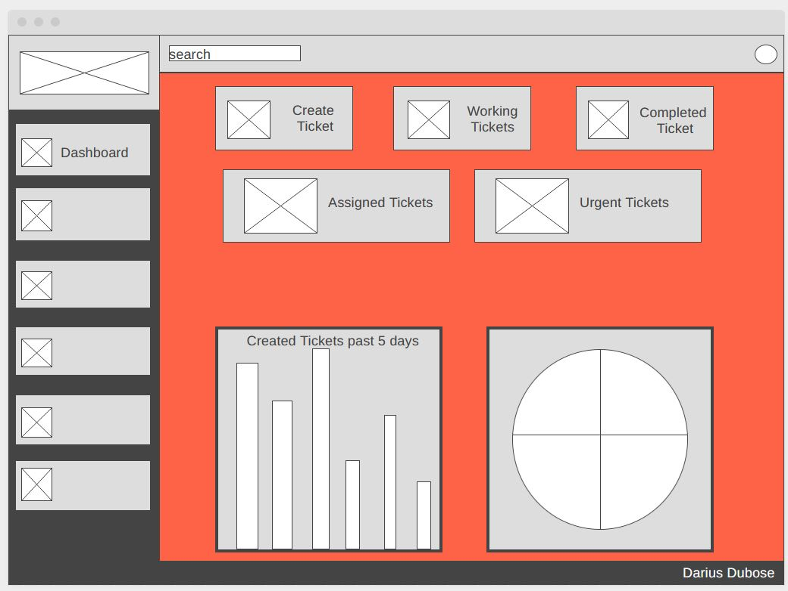

#   
  Insectic 

Insectic will be an interactive bug/patches tracking web application that will forcus on the unplanned work aspect of DevOPs. This Web application will allow Managers to track current items being worked on with detailed statistics to help locate bottle necks.
***
##   
  ERD  

***

***

## DRAFT WIREFRAMES

***

### Dashboard

### Analytics

***

### Archives

***

### Ticket Submission

 

***

### Contact

